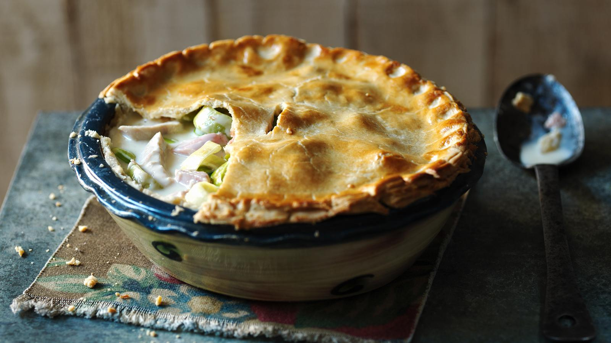

# Non-spicy chicken satay
by Andrew

Image source: https://www.bbc.co.uk/food/recipes/creamy_chicken_ham_and_03877

This recipe is based off [Cafe Delites' satay chicken](https://cafedelites.com/easy-thai-satay-chicken-recipe/)

## Info

| | |
|------------------|--------------|
| Preparation time | 10 minutes   |
| Cooking time     | 30 minutes   |
| Serves           | 4            |

| Each serving (1 / 4 pie) provides | Estimate |
|-----------------------------------|----------|
| Energy                            | 542 kcal |
| Protein                           | 29 g     |
| Carbohydrates                     | 24 g     |
| Fat                               | 37 g     |
| of which saturates                | 21 g     |
| Fiber                             | 1 g      |

## Foreword

TODO

## Equipment:
  - A pie dish
  - A measuring cup
  - A kitchen scale
  - A rolling pin (though it is possible without one!)

## Ingredients:
### For the chicken marinade:
  - coconut milk (4 tablespoons)
  - smooth peanut butter (1 1/2 tablespoons)
  - light brown sugar (1 1/4 tablespoons)
  - soy sauce (1 tablespoon)
  - salt (to taste)
  - either of:
    - Chicken thighs (4). Skinless; bone-in or out.
    - Chicken breast (400 g)
  - olive oil (2 teaspoons)
### For the peanut sauce:
  - coconut milk (all remaining milk from the tin) (1 1 / 3 cup)
  - smooth peanut butter (all natural preferable) (1 / 4 cup)
  - soy sauce (1 tablespoon)
  - brown sugar (1 tablespoon)
  - salt (to taste)
  - lime juice (1 / 2 lime). Freshly squeezed is best
### For garnish
  - Cilantro leaves (to taste)
  - Lime wedges (to taste)

## Method:

TODO
