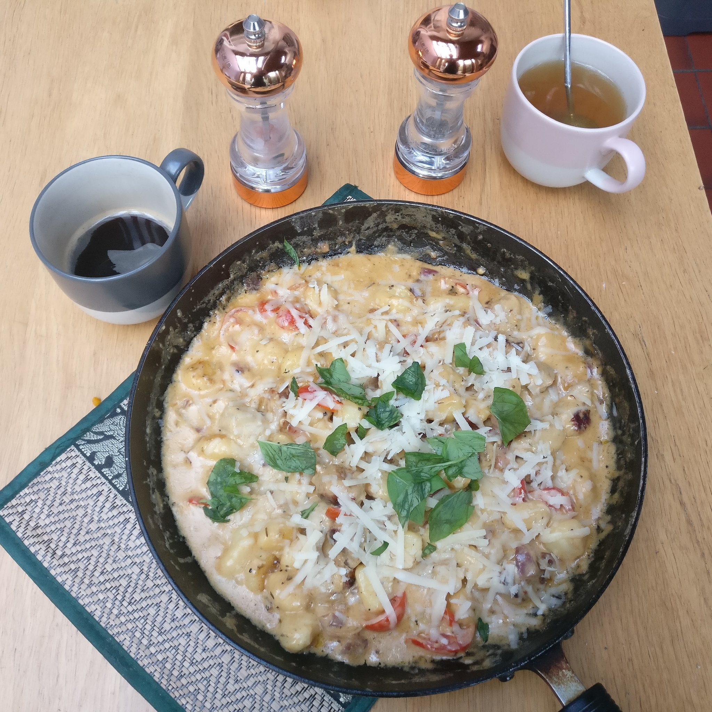

# Gnocchi con crema
by Andrew

This recipe is based off by Natasha Bull's [«One pan creamy gnocchi with sausage»](https://www.saltandlavender.com/one-pan-creamy-gnocchi-with-sausage/).

## Info

| | |
|------------------|--------------|
| Preparation time | 20 minutes   |
| Cooking time     | 30 minutes   |
| Serves           | 4            |

## Foreword

This recipe builds up as you go through it. It's absolutely delicious, and my
advice to get it ready as fast as possible is to start cooking as soon as
possible and then prep the ingredients you're gonna use next while the others
cook.

The original recipe recommends italian sausages, but I personally think that
the texture of cumberland sausages matches the texture of the gnocchi perfectly,
and so I recommend using these instead!

If you're looking to get it done quickly, there's no need to have all
ingredients prepped before you start cooking. But, you may find it less
stressful.

## Equipment:
  - A big pan, with a lid that fits
  - A sharp knife

## Ingredients:
### For the sauce
  - onion (1 bulb), diced
  - garlic (4 cloves), crushed
  - white wine (1 / 3 cup). I use sauvignon blanc, but any dry white will do.
  - double (48 ~ 60 % fat) cream (1 cup). 
  - parmesan cheese (1 / 2 cup)
  - salt
  - pepper
### Others
  - cherry tomatoes (¿1 / 2 cup?)
  - sausages (500 g). I use cumberland sausages, often spiced, because I like the taste and texture.
  - potato gnocchi (500 g), uncooked
  - basil leaves (2 handfuls), torn.
  - oil (1 tbsp). I use olive oil, but vegetable or sunflower are OK substitutes.

## Method:
  1. Warm up a pan to medium-high heat with 1 tbsp of olive oil.
  1. Dice a bulb of onion.
  1. Cut 500 g of sausages into gnocchi-sized pieces
  1. Add the diced onion and the 500 g cut sausages to the pan.
    1. Sauté for 7 mintutes, or until the sausages are cooked through.
    1. Get cutting!
      1. Cut and crush 4 cloves of garlic and measure out 1 / 3 cup of white wine.
      1. Cut 1 / 2 cup of cherry tomatoes each in half
  1. Add the crushed garlic to the pan for 30 s
  1. Add the wine to the pan. Let it cook for 1 minute.
  1. Stir in the 1 / 2 cup cut cherry tomatoes, 1 cup double cream, and 500 g
     gnocchi.
  1. Cover the pan with a lid and reduce the heat to medium. Cook for 5 minutes.
  1. Uncover the pan and leave to cook until the gnocchi is soft all the way
     through
  1. Stir in 1 / 2 cup parmesan cheese, and add salt and pepper each to taste.
  1. Rip up 2 handfuls of basil leaves and spread over the top.
  1. Serve immediately - it's best warm!
